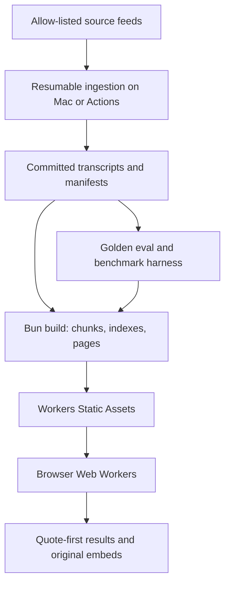

# Architecture specification

## Outcome

Prime Said is an Astro-generated static application hosted as Cloudflare Workers Static Assets. The browser downloads versioned corpus shards, runs lexical and semantic retrieval in workers, and stores model/index state locally. A small Cloudflare Worker is optional for canonical share routes and cache-backed topic pages; static assets are served directly without invoking it.



## Runtime boundaries

| Boundary | Responsibility | Cost model |
| --- | --- | --- |
| Ingestion machine / GitHub Actions | Discover sources, download temporary media, transcribe, align, normalize, deduplicate, enrich, validate | Batch; bounded and resumable |
| Repository | Canonical transcript corpus, manifests, corrections, evals, schemas, code | Git storage; no embeddings/media |
| Build | Chunk text, compute document embeddings, build lexical/ANN structures, pre-render pages, shard assets | Batch; Cloudflare build or Actions |
| Workers Static Assets | Distribute HTML, JS, manifests, models, and indexes | CDN/static; no Worker invocation on asset match |
| Optional Worker | Canonicalize compact share URLs; serve long-cached, unique topic pages | Tiny and exceptional |
| Browser main thread | Input, stable rendering, playback controls, collection UI | Must remain responsive |
| Browser Web Workers | Load/decompress indexes, lexical retrieval, query embedding, ANN/exact semantic retrieval, merge | User device; no query egress |
| Service worker / Cache Storage | Versioned background download, offline reuse, atomic corpus upgrades | User device storage |

## Static deployment contract

The root `wrangler.jsonc` names the Worker `prime-said` and publishes `./dist`. The dashboard project name must match exactly.

Cloudflare Workers Builds setup:

1. On a phone or desktop, open Cloudflare dashboard → Workers & Pages → Create application → Import a repository.
2. Select the public GitHub repository.
3. Set production branch to `main`.
4. Set build command to `bun run build` after the Astro implementation exists.
5. Set deploy command to `bunx wrangler deploy`.
6. Set preview deploy command to `bunx wrangler versions upload`.
7. Pin `BUN_VERSION=1.2.15` initially to match `package.json`; upgrade intentionally with CI.
8. Pin `NODE_VERSION=24.18.0` to match CI and Astro 7's supported runtime.
9. Save and deploy. Workers Builds manages its Cloudflare credential, so GitHub Actions needs no Cloudflare token.

Workers Builds currently includes Bun and permits a `BUN_VERSION` override. Build and deploy commands live in the Cloudflare dashboard; do not assume custom Workers Builds settings in `wrangler.jsonc` control them.

## Asset budget

Cloudflare's current Workers limits allow a maximum 25 MiB per static asset and 20,000 static assets on the Free plan (100,000 on Paid with a sufficiently recent Wrangler). Worker scripts are limited to 3 MB on Free and 10 MB on Paid.

Prime Said adopts lower internal ceilings:

| Artifact | Internal ceiling | Reason |
| --- | ---: | --- |
| Any static asset shard | 16 MiB | 36% margin below 25 MiB platform maximum |
| Preferred data shard | 8–12 MiB compressed | Cellular retry and cache granularity |
| Worker script | 1 MiB compressed | Keep far below the 3 MB Free limit |
| Full-corpus asset count | 5,000 | 4× margin below Free's 20,000 assets |
| First-visit optional download | 300 MB | User-approved upper product budget, not a target |
| Initial semantic package target | 100 MB or less | Preserve a tasteful first visit on average mobile hardware |

The build must fail when any file exceeds 16 MiB or the production asset count exceeds 5,000. Large ONNX weights or vector arrays use content-addressed shards and a manifest. If a model runtime cannot load sharded weights safely, that model fails deployability unless an explicit ADR chooses an external immutable host.

## Versioned asset layout

```text
/assets/app/<build-hash>/...
/assets/corpus/<corpus-version>/manifest.json
/assets/corpus/<corpus-version>/lexical-0001.bin.br
/assets/corpus/<corpus-version>/vectors-0001.i8.br
/assets/corpus/<corpus-version>/ann-0001.bin.br
/assets/models/<model-id>/<revision>/manifest.json
/assets/models/<model-id>/<revision>/weights-0001.bin
```

Manifests contain sizes, hashes, schema versions, compression, dependencies, and a complete shard list. The browser fetches a small root manifest with `no-cache`, then immutable content-addressed assets with a one-year cache policy. A failed upgrade cannot invalidate the currently working corpus; activate the new version only after every required shard verifies.

## Browser boot and progressive enhancement

1. Static HTML and the small UI bundle render.
2. The lexical manifest and query-independent metadata begin loading.
3. The embedding model downloads at low priority in the background when device/storage checks pass.
4. A query before lexical readiness shows a fixed-size progress state, then stable lexical results.
5. A query after lexical readiness returns immediately.
6. Once the semantic model is ready, future searches wait up to the semantic latency budget and return one merged ordering.
7. If semantic readiness completes during visible lexical results, semantic-only candidates appear in a reserved second section below the first stable lexical grid; existing cards do not reorder.
8. The next query uses the fully merged ranker from the start.

The UI must remain fully useful if WebGPU, WASM SIMD, model storage, or the semantic model is unavailable.

## Search execution

- Main thread sends an immutable query request and corpus version to a coordinator worker.
- Lexical and semantic workers operate independently and return ranked IDs plus component scores.
- The coordinator normalizes ranks and merges with weighted reciprocal-rank fusion plus deterministic business boosts.
- Result hydration reads compact metadata/excerpt records only for top candidates.
- Embed code is not created until a user requests playback.

Exact phrase and rare-term queries intentionally lean lexical. Longer descriptive queries lean semantic. This prevents a single-word literal query from being diluted by semantic neighbors.

## Storage and memory

- Use Cache Storage for immutable network responses and IndexedDB for parsed/version state, history, and collections.
- Do not duplicate full uncompressed vectors in multiple stores.
- Use scalar-quantized document vectors (initial target: signed int8) with per-vector or per-block scale where quality permits.
- Decode only the active lexical partitions and ANN/vector shards.
- Keep model execution and vector search off the main thread.
- Release model intermediate tensors between queries and enforce a device-class memory budget discovered at startup.
- Expose a “remove downloaded search data” control.

## Static pages and optional Worker

Curated moment, topic, and supercut pages are static Astro output whenever known at build time. The optional Worker may:

- resolve a compact collection code to a canonical static-like page;
- validate and canonicalize a bounded query/topic slug;
- render a page only from already-built corpus records and cache it for the corpus lifetime;
- return `noindex` for arbitrary or low-value pages.

It may not embed queries, execute corpus search for the main app, generate text with an LLM, proxy video bytes, or become required for ordinary results.

## Deployment and cache invalidation

- Every build references one immutable corpus version.
- A daily source scan does not deploy when no verified corpus change exists.
- Transcript updates create a new corpus version and invalidate only the root manifest and affected static pages.
- The service worker compares versions, downloads missing shards, verifies hashes, and atomically switches.
- Rollback means promoting the previous Cloudflare Worker version; immutable assets remain addressable.

## Security and privacy

- No search query telemetry by default.
- No secrets in browser assets, GitHub caches, transcript PRs, or model manifests.
- Treat downloaded EJS challenge code as executable third-party input; use yt-dlp's bundled EJS scripts and Deno's restricted runtime.
- Contributor workflows from forks have read-only caches and no deployment authority.
- Sanitize all transcript-derived HTML; render text as text.
- Collection URLs are public by construction and must not claim privacy.

## Observability without a backend

Build reports record corpus counts, source health, asset sizes, eval scores, model revision, and latency benchmark summaries. Optional aggregate Web Analytics may measure page views and Core Web Vitals, but search text and collection contents remain uncollected.

## Failure modes

| Failure | User-visible behavior | Recovery |
| --- | --- | --- |
| Semantic model download fails | Lexical search remains available; concise retry control | Retry later or select smaller model tier |
| Storage quota denied | Session-only indexes; explain repeat download | User frees storage or continues lexical-lite |
| Corpus upgrade interrupted | Current version remains active | Resume missing immutable shards |
| Source video deleted | Appearance marked unavailable; surviving alternate promoted | Rebuild health manifest/pages |
| Embed refuses playback | Show original timestamp link and next item | Continue collection manually |
| yt-dlp extraction breaks | Existing corpus still serves; ingestion opens a classified failure | Version fallback policy in ingestion spec |
| Large device memory pressure | Stop semantic worker; retain lexical results | Reload smaller index/model tier |

## Architecture fitness functions

CI/builds must verify:

- no hosted asset exceeds 16 MiB;
- production asset count stays below 5,000 until an ADR changes the budget;
- all manifests and corpus records validate against schemas;
- committed data contains no media/model/embedding blobs;
- golden retrieval and timestamp gates pass;
- mobile memory and latency do not regress beyond the selected model tier's budget;
- the application works with the optional Worker disabled except for explicitly dynamic share routes;
- a dry-run deploy resolves `dist/` and `wrangler.jsonc` cleanly.
