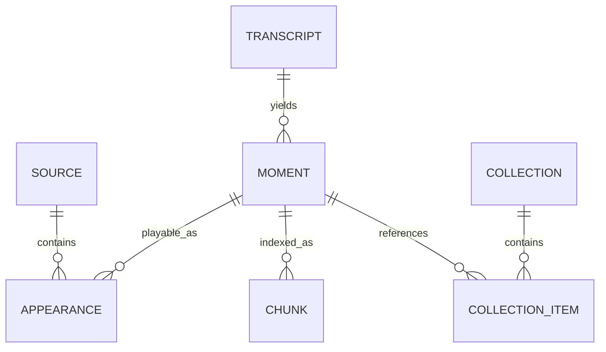

# Data model and identity

## Core distinction

A **moment** is a span of spoken content. An **appearance** is one place that moment can be played. The same underlying speech may appear in a long official upload, a shorter official clip, a Twitch VOD, or an interview excerpt. Separating them prevents duplicate search results while allowing a surviving copy to replace a deleted one.



## Entities

### Source

A platform upload or stream archive discovered from an allowed channel or approved contribution.

Key fields:

- `sourceId`: stable platform-qualified ID such as `youtube:S_7SE_Uzk-I`.
- `platform`, `platformId`, `channelId`, `channelName`.
- title, description, publication time, duration, canonical URL.
- provenance: allow-list entry, discovery run, and contributor PR when applicable.
- availability status and last checked time.
- media fingerprints when locally computed.

### Transcript

The normalized, time-aligned words for a source. Word timestamps are preferred; segment timestamps are required.

- Keeps raw ASR text and normalized display/search forms logically distinct.
- Records model ID/revision, runtime versions, language, diarization status, and confidence where provided.
- Human corrections are patch records with provenance, not invisible mutation.
- Transcript IDs are content-addressed from normalized timed tokens plus schema version.

### Moment

A speaker-complete span selected for search, a curated page, a collection, or deduplication. It is not necessarily identical to an indexing chunk.

- `momentId` is derived from a canonical acoustic/text fingerprint plus schema version when confident; otherwise it is a durable assigned ID.
- Start/end boundaries align to sentences and include small playback handles.
- Stores normalized quote, neighboring context references, entities, phrases, topics, and confidence.
- Can carry editorial labels but never an unsupported generated quote.

### Appearance

Maps a moment to a source and precise playback interval.

- `appearanceId` derives from `sourceId`, start/end milliseconds, and appearance schema version.
- Contains direct timestamp URL, embeddable URL data, availability, and match confidence.
- Records whether the appearance is full context, excerpt, mirrored, edited, or unknown.

### Chunk

A retrieval unit derived from transcript segments. Chunks overlap and may contain several moments. They are build artifacts, not the permanent citation ID.

- Includes token span, time span, sentence boundaries, source/moment references, text variants, terms/entities, and an embedding row ID.
- Changing chunk strategy does not break saved moments or URLs.

### Collection

A versioned ordered list of moment references with optional title and curator note. Local collections may include a preferred appearance override; public URLs should still resolve to the current canonical healthy appearance when sensible.

## Source selection

Canonical appearance scoring is deterministic and independently testable:

1. available and playable beats unavailable;
2. allow-listed official creator source beats third-party copy;
3. longest surrounding context beats shorter excerpt;
4. earlier publication and stronger fingerprint evidence break originality ties;
5. known unedited source beats edited/unknown;
6. higher timestamp alignment confidence breaks the final tie.

The UI shows the canonical appearance first and labels alternates. A deleted long source is not quoted from a local copy; if a surviving approved shorter appearance exists, it becomes canonical. If none survives, the moment page becomes unavailable or is removed according to policy.

## Deduplication pipeline

Deduplication is conservative. False merges can misattribute words and are worse than an occasional duplicate result.

1. **Exact source ID:** identical platform ID is the same source.
2. **Transcript shingles:** MinHash/SimHash over normalized timed word shingles proposes overlapping candidates.
3. **Audio fingerprint:** locally computed fingerprints confirm that speech/audio windows match despite intros or edits.
4. **Time-map fit:** align matching token/acoustic anchors and fit an offset or piecewise mapping.
5. **Classification:** mark full copy, excerpt, compilation segment, near-duplicate, or merely related.
6. **Human review threshold:** low-confidence merges remain separate; high-confidence matches can share a moment.

An appearance match records evidence and algorithm version so it can be recomputed.

## Transcript representations

Each segment may include:

- `verbatim`: ASR output after only encoding/whitespace repair.
- `display`: punctuation, casing, and approved obvious corrections.
- `search`: case-folded and normalized form used by the lexical index.
- `tokens`: timed token/word records.

Search normalization may expand common technical spellings (`Type Script` → `TypeScript`) through a versioned dictionary while the displayed quote preserves the corrected spoken form. Every automatic replacement keeps the original span and rule ID.

## Chunking defaults

Initial chunks use sentence-aware windows targeting 35–55 seconds, with approximately 12–18 seconds of overlap. Hard maximum is 90 seconds. Short adjacent sentences may be combined; long sentences may be split at ASR pauses with ellipses only in display snippets, not in stored transcript text.

Three boundaries are intentionally distinct:

- retrieval chunk: optimized for recall;
- display excerpt: optimized for scanning and complete thought;
- playback moment: optimized for evidence, including small lead-in/out handles.

The eval harness tunes these independently.

## Stable URL design

- Moment page: `/m/<moment-id>/<readable-slug>/`
- Curated topic: `/topics/<topic-slug>/`
- Curated supercut: `/cuts/<cut-slug>/`
- Compact local collection: `/c/<versioned-payload>/`
- Search state: `/?q=<encoded-query>` for client use; arbitrary query state is not automatically indexable.

IDs use a version prefix and a collision-checked base-N encoding. Do not encode a raw YouTube ID and timestamp into a permanently meaningful four-character code; the code space is too small and ties identity to one fragile appearance. Compact codes resolve to stable moments or versioned payload dictionaries.

## Repository layout for corpus data

```text
corpus/
  sources/<platform>/<source-id>.json
  transcripts/<platform>/<source-id>.json
  corrections/<platform>/<source-id>.json
  moments/<moment-id>.json
  collections/<collection-id>.json
  dictionaries/technical-terms.json
  manifests/corpus.json
```

Generated chunks, embeddings, indexes, downloaded media, and model weights do not belong in Git.

## Integrity invariants

- Every appearance references an existing source and moment.
- Every timestamp is within source duration with declared tolerance.
- Segment times are monotonic and non-negative.
- Corrections reference exact original token/time spans and include a reason.
- No moment is published as a quotation without at least one available appearance or an explicit historical/unavailable policy state.
- Search excerpts are derivable from committed transcript data.
- Stable IDs never change because a title, slug, canonical appearance, or chunking strategy changed.
- Every generated artifact names the corpus schema and source commit that produced it.

Machine-readable schemas live in `docs/schemas/`.
